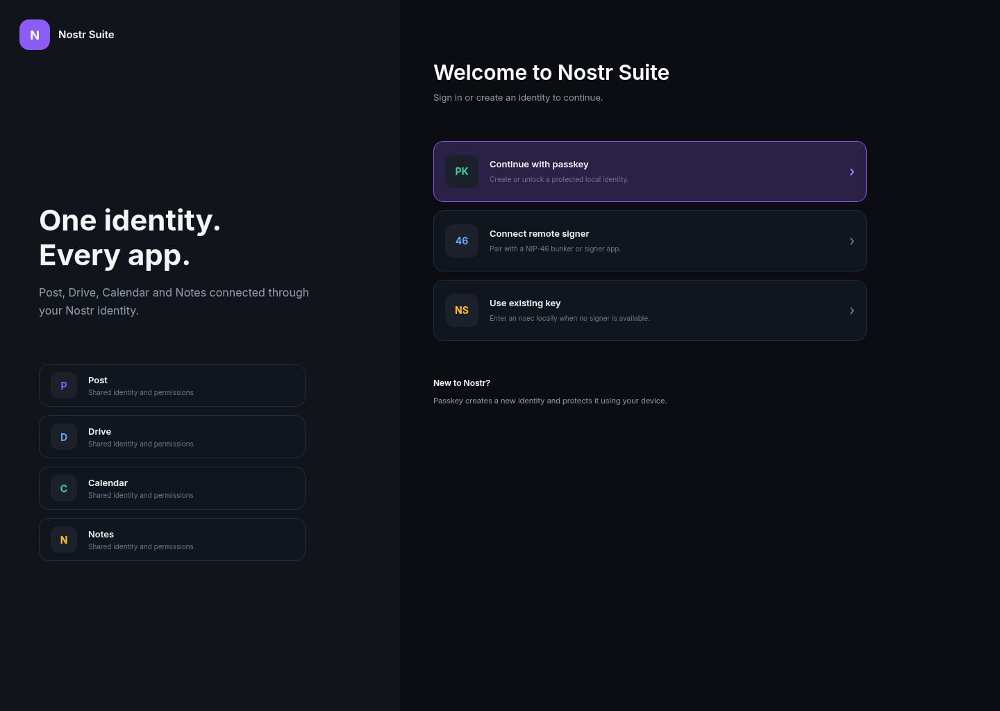
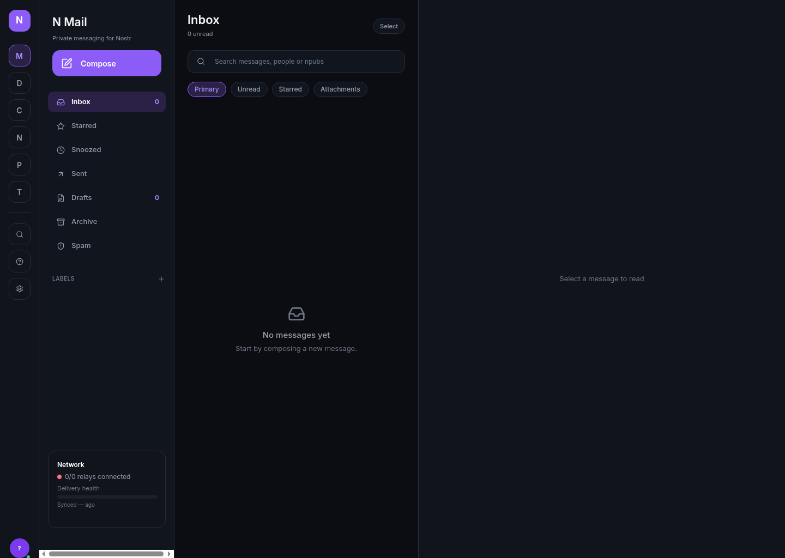
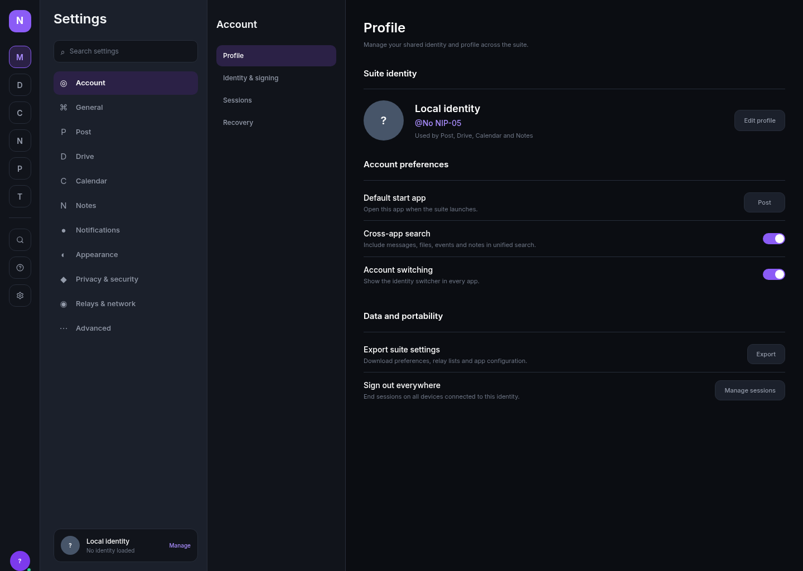
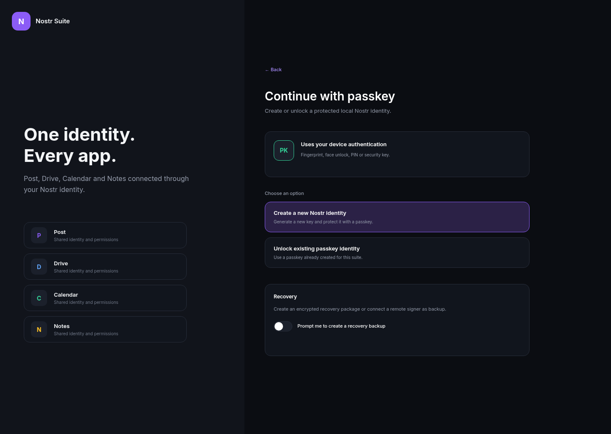
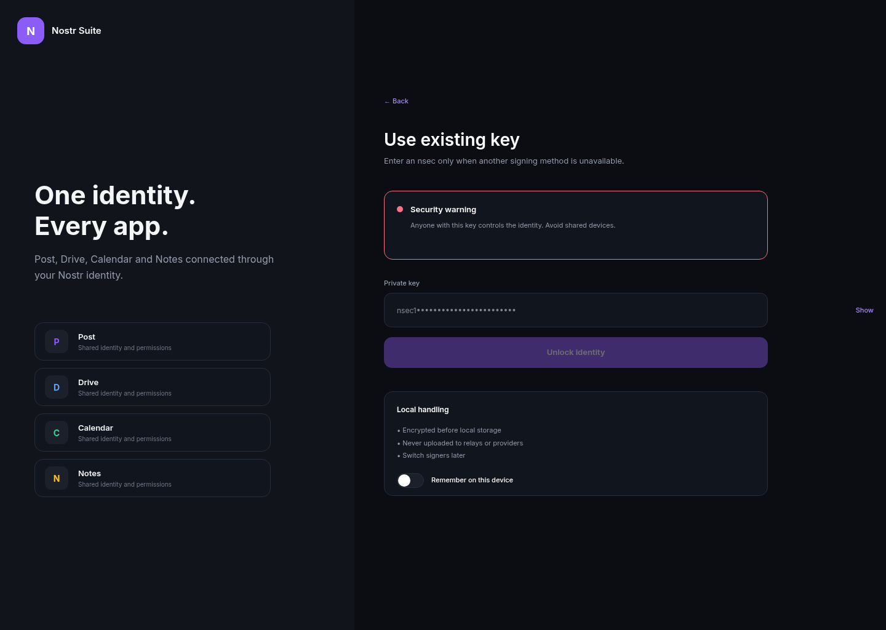

# Post — Private messaging for Nostr

Post is a **privacy-focused, email-styled direct messaging client** for the [Nostr](https://nostr.com) protocol. It combines the familiar UX of a desktop email client with Nostr's end-to-end encrypted messaging (NIP-17 + NIP-44), and ships as a native desktop application powered by Tauri.

> **Status:** v0.1.0 — Active development.

---

## Screenshots

| Welcome / identity choice | Inbox view | Settings & relays |
|:---:|:---:|:---:|
|  |  |  |

| Passkey sign-in | NSEC key import |
|:---:|:---:|
|  |  |

---

## Features

### Core messaging
- **Email-styled inbox** — read/unread, sender, subject, preview, timestamps
- **End-to-end encryption** — NIP-17 DMs with NIP-44 encryption
- **Threaded conversations** — reply chains via NIP-10 tags
- **Rich compose** — markdown toolbar, recipient pills, Cc/Bcc, attachments, schedule send, draft autosave
- **Inline reply** — format toolbar in the reading pane

### Mailbox management
- **8 mailboxes** — Inbox, Starred, Snoozed, Sent, Drafts, Archive, Spam
- **Custom labels** — color-coded with CRUD and per-label pages
- **Filter chips** — Primary, Unread, Starred, Attachments
- **Full-text search** — messages, people, and npubs via minisearch
- **Keyboard navigation** — arrows, escape, shortcuts throughout

### Identity & authentication
- **Multiple sign-in methods** — Passkey, NIP-07 (browser extension), NIP-46 (remote signer), raw nsec import
- **Profile resolution** — kind 0 events + NIP-05 verification
- **Key generation** and import/export

### Relays
- **Relay pool** — health monitoring, latency tracking, multi-relay delivery
- **5 default seed relays**
- **Network status** — connected count, health percentage, sync age
- **Per-message relay overrides**

### Attachments (Blossom)
- **Blossom media server** — upload/download/delete via NIP-98 HTTP auth
- **Encrypted blobs** — AES-GCM with file-key wrapping
- **Upload progress** — rows, progress bars, status states

### Desktop native (Tauri)
- **Native window** — system tray (Show Post, Compose, Quit)
- **Stronghold vault** — secure nsec storage on disk
- **Auto-updater** — platform-specific artifacts (deb, AppImage, msi, nsis, dmg)

### Persistence & offline
- **Dexie IndexedDB** — messages, drafts, labels, contacts, relay configs
- **Zustand stores** — all application state with Dexie sync
- **Offline-first** — local cache with relay streaming

---

## Quick start

```bash
pnpm install
pnpm dev
```

Open [http://localhost:3000](http://localhost:3000) in your browser.

### Commands

| Command | Description |
|---------|-------------|
| `pnpm dev` | Start Next.js dev server |
| `pnpm build` | Build for production |
| `pnpm lint` | Run Next.js lint |
| `pnpm typecheck` | Run TypeScript type checking |
| `pnpm test` | Run unit tests (Vitest) |
| `pnpm test:e2e` | Run E2E tests (Playwright) |
| `pnpm tauri:dev` | Start Tauri desktop dev mode |
| `pnpm tauri:build` | Build Tauri desktop app |

---

## Tech stack

| Layer | Technology |
|-------|-----------|
| **Frontend** | Next.js 15 (App Router), React 19, TypeScript 5.8 |
| **Styling** | Tailwind CSS v4, shadcn/ui, lucide-react |
| **State** | Zustand 5, Dexie.js 4 (IndexedDB) |
| **Nostr** | nostr-tools v2, nostr-passkey |
| **Desktop** | Tauri 2 (Rust), plugins: stronghold, updater, store |
| **Forms** | react-hook-form, zod |
| **Testing** | Vitest, React Testing Library, Playwright, MSW |
| **Package manager** | pnpm (workspace monorepo) |

---

## Project structure

```
post/
├── app/                        # Next.js App Router
│   ├── (suite)/mail/           # Mail app (inbox, compose, reading)
│   ├── (suite)/contacts/       # Contacts manager
│   ├── (suite)/settings/       # Settings
│   ├── login/                  # Authentication flow
│   └── coming-soon/            # Placeholder apps
├── components/                 # Shared React components
│   └── ui/                     # shadcn/ui primitives
├── lib/                        # Application logic
│   ├── stores/                 # Zustand stores
│   ├── db/schema.ts            # Dexie IndexedDB schema
│   └── mock/                   # Mock data for dev
├── packages/
│   ├── nostr-core/             # Nostr protocol (NIP-17/44, keys, relays)
│   ├── suite-shell/            # Reusable suite shell
│   └── ui/                     # Shared UI primitives
├── src-tauri/                  # Tauri desktop wrapper (Rust)
│   ├── src/                    # Plugin registration, tray menu
│   └── icons/                  # App icons
├── public/                     # Static assets
└── e2e/                        # Playwright E2E tests
```

---

## Architecture

### Protocol layer — `@post/nostr-core`

The `packages/nostr-core` package encapsulates all Nostr protocol logic:

- **NIP-17** — encrypted direct messages
- **NIP-44** — encryption scheme
- **NIP-59 (planned)** — gift-wrap sealed sender
- **Key management** — generation, import, storage
- **Relay pool** — connection management, health checks
- **Profile resolution** — kind 0 events, NIP-05 verification
- **Blossom** — media server upload/download
- **Nostr Drive** — encrypted file storage

### State management — Zustand + Dexie

Application state is managed through Zustand stores that sync with Dexie IndexedDB for persistence. Key stores include `identity`, `messages`, `mailboxes`, `relays`, `contacts`, `labels`, `compose`, and `settings`.

### Desktop shell — Tauri

The Rust backend provides a native desktop wrapper with:
- Window management (min 900×600, default 1440×1024)
- System tray with app menu
- Stronghold vault for secure key storage
- Auto-updater with platform-specific bundles

---

## Desktop build

```bash
pnpm tauri:build
```

Builds the native desktop app for your current platform. Supported targets: **deb**, **AppImage**, **msi**, **nsis**, **dmg**.

---

## Suite ecosystem

Post is the first app in the **Nostr Suite** ecosystem — a planned collection of interconnected Nostr apps including Drive, Calendar, Contacts, Notes, and Tasks, all sharing a common shell (IconDock, app switcher, identity/relay context).

---

## License

Private — v0.1.0. All rights reserved.
